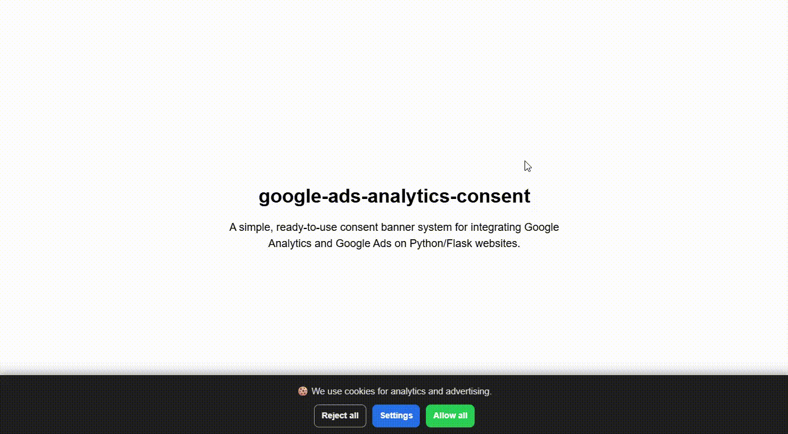

# 🍪 google-ads-analytics-consent
### Cookie bar system for Python/Flask — ready for Google Analytics & Google Ads  
by Tom Salaj

[](https://www.python.org/)  
[](LICENSE)

---

## 🧰 What is it?

A lightweight and ready-to-use cookie consent system for Python/Flask. Deploy in minutes and load Google Analytics and Google Ads only after user approval. Fully customizable, no external dependencies, simple and effective for any small or personal project.

**google-ads-analytics-consent** is a lightweight, ready-to-use cookie consent system for **Python/Flask** websites.  
It provides:

- a modern cookie banner  
- a privacy settings modal  
- separate consent options for Analytics, Ads, and Personalisation  
- first-party cookie storage  
- conditional loading of **Google Analytics (GA4)** and **Google Ads**  
- secure CSRF-protected POST handling  

Ideal for small projects, personal websites, and developers who want **full control** without external services.

---

## 🎬 Demo



---

## 🚀 Features

- Responsive cookie bar & modal  
- Three consent categories:  
  - Analytics (GA4)  
  - Advertising (Google Ads conversions / remarketing)  
  - Ad personalisation  
- CSRF-protected `/set-consent` endpoint  
- No tracking unless explicitly approved  
- Fully client-side; no external dependencies  
- Works on localhost and HTTPS  
- Only one requirement: **Flask**

---

## 📁 Folder Structure

```
google-ads-analytics-consent/
├── static/
│   ├── css/
│   │    └── cookies.css
│   └── js/
│        └── cookies.js
├── templates/
│   └── index.html
├── app.py
├── screen.gif
└── requirements.txt
```

---

## ⚙️ Customization

### 1️⃣ Set your secret key

In `app.py`:

```bash
app.config['SECRET_KEY'] = 'your-secret-key-here'
   ```

### 2️⃣ Enable HTTPS mode

If deployed on HTTPS:

```bash
SESSION_COOKIE_SECURE=True
   ```

### 3️⃣ Cookie configuration

Inside `/set-consent`:

```bash
secure=True,           # Enable for HTTPS  
httponly=False,        # Must remain False (JS reads this cookie)
   ```

### 4️⃣ Insert your Google IDs

Replace XXXXXXXX with your own Google Analytics and Google Ads IDs.:
   ```bash
<script async src="https://www.googletagmanager.com/gtag/js?id=G-XXXXXXXX"></script>
<script async src="https://www.googletagmanager.com/gtag/js?id=AW-XXXXXXXX"></script>
<script>
window.dataLayer = window.dataLayer || [];
function gtag(){dataLayer.push(arguments);}

window.enableTracking = function() {
gtag('js', new Date());
gtag('config', 'G-XXXXXXXX');
gtag('config', 'AW-XXXXXXXX');
};

if (document.cookie.includes('user_consent') && document.cookie.includes('"analytics":true')) {
window.enableTracking();
}
</script>
   ```

in your HTML template cookies.html

---

## 🧩 Custom Styles & Extensions

This consent system is intentionally simple and fully open.  
Feel free to modify:

- the CSS (design, animations, layout)  
- the JavaScript logic (additional options, interactions)  
- the HTML structure (more categories, different UI)  
- the Flask handler (store consent in a database, log events, etc.)

You can easily adapt it for **any type of cookies**, not just Google Analytics or Google Ads.  
The entire project is designed to be **fully customizable** — adjust it to your needs.

---

## 💾 Installation

pip install -r requirements.txt

---

## ▶️ Run the project

   ```bash
   flask run
   ```

Open:

http://127.0.0.1:5000

---

## 📝 License

Released under the **MIT License**.  
Free to use, modify, and distribute. No warranty provided.

---

## 🚀 Final Words

**Learn, build, improve — and enjoy the process.**  
*Tom Salaj*

[](https://www.buymeacoffee.com/tomsalaj)
